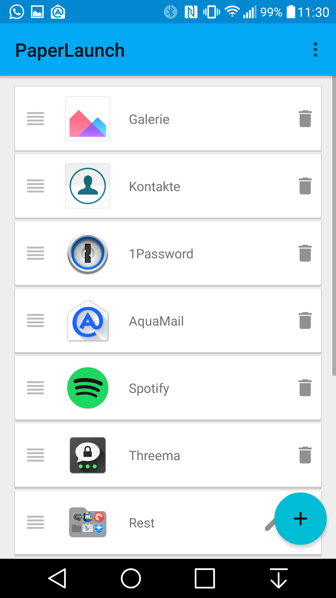
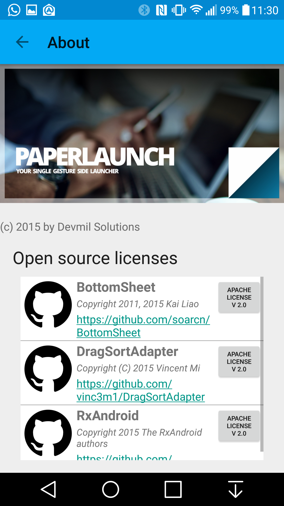
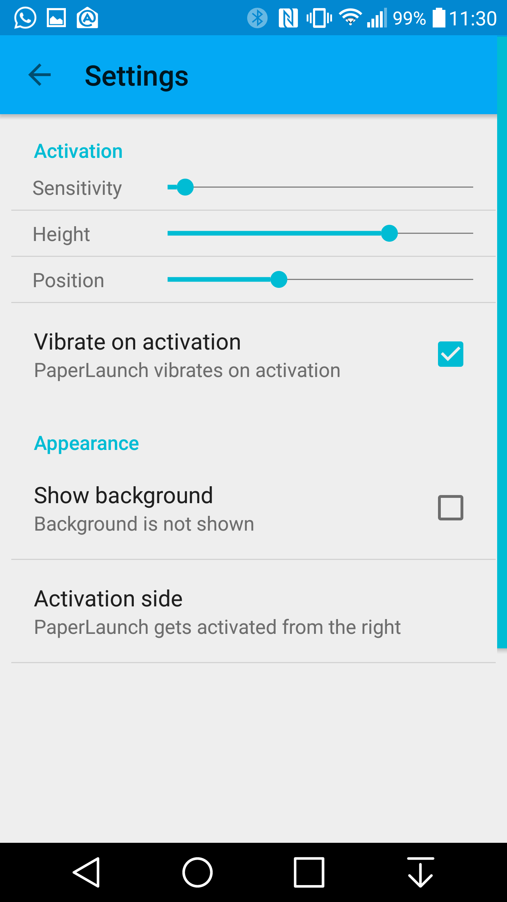

|Master|Dev|
| --- | --- |
|  |  |

# PaperLaunch
An Android side launcher in Material design with a strong focus on UX speed and material design.
Furthermore it allows to organize the Launcher items into a folder structure that easily extends the launcher by so called lanes and integrates into the Launcher selection flow.

## Speed
Only one gesture is needed to launch an app. 
The directory structure used defines the gesture needed to launch an app.
Besides the speed of selecting an app the slowdown of accidentally launching apps by activating the Launcher by accident is lowered by having an neutral zone that is focused on activation that doesn't launch anything.

## Design
The whole launcher is heavily inspired by Material Design. The whole Launcher UI concept and all the visuals mainly use concepts from the Material Design Spec.

## Screenshots

   

## LICENSE

    Copyright 2015 Devmil Solutions (Michael Lamers)

    Licensed under the Apache License, Version 2.0 (the "License");
    you may not use this file except in compliance with the License.
    You may obtain a copy of the License at

        http://www.apache.org/licenses/LICENSE-2.0

    Unless required by applicable law or agreed to in writing, software
    distributed under the License is distributed on an "AS IS" BASIS,
    WITHOUT WARRANTIES OR CONDITIONS OF ANY KIND, either express or implied.
    See the License for the specific language governing permissions and
    limitations under the License.
